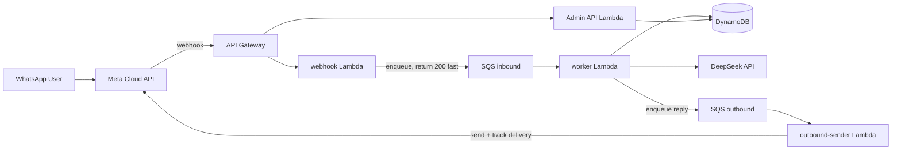

# Visa Bot — Serverless WhatsApp Visa Chatbot

A serverless WhatsApp chatbot for a company that sells WhatsApp VISAs. Built with
**TypeScript / Node.js**, **DeepSeek** for language understanding, **DynamoDB** for state,
and **SQS** to buffer work between Meta and the processing logic.

## Architecture



**Three Lambdas:**

1. `webhook-handler` — verifies Meta, dedupes by `event_id`, enqueues, returns `200` fast.
2. `conversation-worker` — loads conversation state, calls DeepSeek for intent/slots,
   runs verified business logic, persists the state transition, enqueues the reply.
3. `outbound-sender` — sends replies via the WhatsApp Cloud API (retries/delivery isolated).

**Memory model (Option B):** each conversation record keeps a rolling transcript (capped
at `MAX_HISTORY_MESSAGES`) plus the current state-machine position and collected slots.
Lambda is stateless — all memory lives in DynamoDB, with TTL to auto-expire stale chats.

## Key design rule

DeepSeek **only** classifies intent and extracts slots (destination, nationality, purpose,
duration). Prices, requirements, eligibility, and application status **always** come from
DynamoDB. The model never invents facts.

## Endpoints

### Meta-facing (public webhook)

| Method | Path       | Purpose                                  |
| ------ | ---------- | ---------------------------------------- |
| `GET`  | `/webhook` | Meta verification (echo `hub.challenge`) |
| `POST` | `/webhook` | Message events (verify, dedupe, enqueue) |

### Admin API

| Method   | Path                      | Purpose                   |
| -------- | ------------------------- | ------------------------- |
| `GET`    | `/health`                 | Health check              |
| `GET`    | `/products`               | List catalogue            |
| `POST`   | `/products`               | Add/update a visa product |
| `DELETE` | `/products/{dest}/{type}` | Remove a product          |
| `GET`    | `/applications`           | List applications         |
| `GET`    | `/applications/{id}`      | Application status        |
| `POST`   | `/messages`               | Test send (dev)           |

## Project structure

```
src/
  lambdas/
    webhook-handler/handler.ts
    conversation-worker/handler.ts
    outbound-sender/handler.ts
  shared/
    config.ts              # env config
    types.ts               # domain types
    db/dynamo.ts           # single-table access patterns
    whatsapp/{schemas,client}.ts
    ai/{deepseek,prompts}.ts
    domain/{catalogue,assessments,applications}.ts
    conversations/engine.ts # state machine
  api/admin/{handler,router,server}.ts
scripts/seed.ts            # seed catalogue
tests/                     # vitest
template.yaml              # SAM
```

## Setup

```bash
npm install
cp .env.example .env        # fill in values (DeepSeek key optional — fallback kicks in)
```

## Local development

```bash
npm run typecheck           # type check
npm test                    # unit tests (no AWS needed)
npm run dev:admin           # run admin API locally on :3000
npm run seed                # seed catalogue (requires AWS creds + table)
```

## Build & deploy

```bash
npm run build               # tsc → dist/ (optional; SAM uses esbuild)
sam build
sam deploy --guided
```

Secrets are passed as `sam deploy --parameter-overrides` or via Secrets Manager in
production. Never hardcode tokens.

## Meta setup (pending)

Until you register the Meta developer app, the WhatsApp client logs to console instead
of sending, and DeepSeek uses a deterministic keyword fallback. Once you have credentials,
set the four `WHATSAPP_*` variables and `DEEPSEEK_API_KEY`.
# Dubai-Visabot
