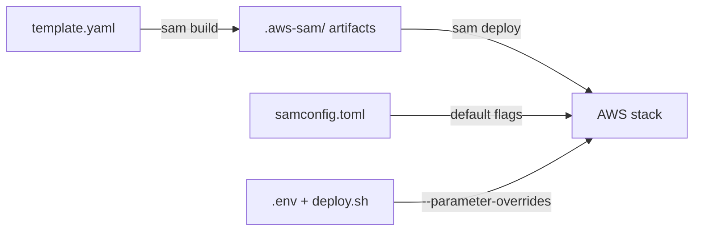

I'll teach you SAM from the ground up, using your actual `template.yaml` as the working example. Let me first grab the remaining infra files so I reference them accurately.

Read 

Read 

Read 

Excellent — SAM is exactly the right thing to learn next, because your `template.yaml` is the single source of truth that *wires* all the Lambdas, queues, and tables together. Once you can read it, the data flow from the previous turns "clicks" into place. Let me teach it bottom-up.

---

## 1. What SAM actually is

SAM (`AWS::Serverless`) is a **macro/transform layer on top of CloudFormation**. Your `template.yaml` is *not* native CloudFormation — the `Transform` line is the key:

```yaml
AWSTemplateFormatVersion: "2010-09-09"
Transform: AWS::Serverless-2016-10-31
```

That `Transform` tells CloudFormation: *"expand these shorthand `AWS::Serverless::*` resources into full CloudFormation resources before deploying."*

So SAM's value is **less boilerplate**. You write:

```yaml
WebhookFunction:
  Type: AWS::Serverless::Function
  Events:
    Webhook:
      Type: Api
      Properties:
        Path: /webhook
        Method: any
```

…and SAM generates behind the scenes: the `AWS::Lambda::Function`, the IAM role, the API Gateway REST API, the stage, and a `AWS::Lambda::Permission` to let API Gateway invoke the Lambda. All of that is invisible to you.

**Mental model:** CloudFormation = the raw engine. SAM = syntactic sugar for the 90% case (serverless apps).

---

## 2. The anatomy of a template (top-level sections)

Every SAM template has a fixed set of top-level keys:

| Key | Purpose | In your template? |
|---|---|---|
| `AWSTemplateFormatVersion` | Schema version (always `2010-09-09`) | ✅ |
| `Transform` | Enables SAM macros | ✅ |
| `Description` | Human label | ✅ |
| `Globals` | Defaults applied to every resource of a type | ✅ |
| `Parameters` | Inputs at deploy time (secrets, env) | ✅ |
| `Resources` | **The actual infrastructure** (required) | ✅ |
| `Outputs` | Values surfaced after deploy (URLs, ARNs) | ✅ |

You can also have `Mappings`, `Conditions`, `Metadata` — not used here.

---

## 3. Intrinsic functions — the wiring glue

This is the single most important concept to internalize. Resources talk to each other via a handful of `!` functions:

| Function | What it does | Example in your template |
|---|---|---|
| `!Ref` | Reference a resource/parameter by its **name**, returns its "default" value | `!Ref Table` → table name; `!Ref WhatsAppVerifyToken` → the param value |
| `!GetAtt` | Reference a specific **attribute** of a resource | `!GetAtt InboundQueue.Arn` → the queue's ARN |
| `!Sub` | String interpolation with `${}` | `!Sub "https://${ServerlessRestApi}..."` |
| `!GetAtt ...` (with `.`) | Dot-notation attribute | `!GetAtt InboundQueue.QueueName` |

**The crucial subtlety: `!Ref` returns *different things* for different resource types.**

- `!Ref Table` (DynamoDB) → the **table name** (a string)
- `!Ref InboundQueue` (SQS) → the **queue URL**
- `!Ref WhatsAppVerifyToken` (Parameter) → the **value passed at deploy**
- `!Ref` a Lambda function → its **function name**

That's why the code sometimes needs the *Arn* instead of the *name*, and uses `!GetAtt` to get it. Example from your template — the worker needs the queue's ARN to *subscribe* to it, but its URL to *send* to it:

```yaml
Events:
  Inbound:
    Type: SQS
    Properties:
      Queue: !GetAtt InboundQueue.Arn     # ARN → to subscribe
Environment:
  Variables:
    OUTBOUND_QUEUE_URL: !Ref OutboundQueue  # URL → to send messages
```

This is the #1 source of confusion when you start writing SAM. **Remember what each resource's `!Ref` returns.**

---

## 4. `Globals` — shared defaults

```yaml
Globals:
  Function:
    Runtime: nodejs20.x
    Handler: handler.handler
    Timeout: 30
    MemorySize: 256
    Architectures:
      - arm64
    CodeUri: .
```

This says: *every `AWS::Serverless::Function` gets these defaults, unless it overrides them.* It's DRY for the 5 Lambdas you have.

Two gotchas you've **already hit and logged** (worth remembering when you write your own):

1. **`Globals.Function.Environment` gets *replaced*, not merged**, when a function defines its own `Environment`. That's why every function repeats `DYNAMODB_TABLE: !Ref Table` — the global env doesn't "inherit" into function-level env.
2. `Metadata` (the esbuild build config) is a **resource-level sibling of `Properties`**, not *inside* `Properties`. Putting it inside `Properties` silently breaks the build.

---

## 5. `Parameters` — deploy-time inputs

```yaml
Parameters:
  DeepSeekApiKey:
    Type: String
    NoEcho: true        # hide the value in logs/console
    Default: ""         # empty default = deploy in stub mode
    Description: ...
```

Parameters are how secrets/config enter the stack **without hardcoding**. They're filled in one of two ways:

- `sam deploy --parameter-overrides "DeepSeekApiKey=..."` (what your `deploy.sh` does)
- Interactively at `sam deploy --guided` (what generated `samconfig.toml`)

`NoEcho: true` is critical for secrets — it redacts the value in CloudFormation logs.

The `Default: ""` is a deliberate engineering choice from your PROJECT_LOG: it lets the stack deploy **before** real Meta/DeepSeek credentials exist (the code falls back to stubs).

---

## 6. Resources — the actual infra

Let me map every resource in your template to what it *is*:

### DynamoDB table
```yaml
Table:
  Type: AWS::DynamoDB::Table
  Properties:
    TableName: visa-bot
    BillingMode: PAY_PER_REQUEST          # no capacity planning
    AttributeDefinitions: ...              # pk + sk are strings
    KeySchema:
      - AttributeName: pk
        KeyType: HASH                     # partition key
      - AttributeName: sk
        KeyType: RANGE                    # sort key
    TimeToLiveSpecification:
      AttributeName: expiresAt
      Enabled: true
```
This maps **directly** to the `pk`/`sk` single-table design you already studied. `PAY_PER_REQUEST` means "serverless billing" — you only pay per read/write, no provisioned capacity.

### SQS queues + DLQs (dead-letter queues)
```yaml
InboundQueue:
  Type: AWS::SQS::Queue
  Properties:
    VisibilityTimeout: 60
    RedrivePolicy:
      deadLetterTargetArn: !GetAtt InboundDLQ.Arn
      maxReceiveCount: 3
InboundDLQ:
  Type: AWS::SQS::Queue
```

The `RedrivePolicy` says: *if a message is received and fails 3 times (`maxReceiveCount`), move it to the DLQ instead of retrying forever.* This is the **poison-message protection** — a message that crashes the worker won't infinitely loop; after 3 failures it's quarantined in `InboundDLQ` where you can inspect it.

`VisibilityTimeout: 60` means: once a consumer picks up a message, it's invisible to others for 60s while being processed. If the worker crashes, the message becomes visible again after 60s.

### Lambdas (`AWS::Serverless::Function`)

Every one of your 5 functions has the same skeleton. Let me dissect `WorkerFunction` as the richest example:

```yaml
WorkerFunction:
  Type: AWS::Serverless::Function
  Metadata:                    # ← SAM build config (esbuild)
    BuildMethod: esbuild
    BuildProperties:
      EntryPoints:
        - src/lambdas/conversation-worker/handler.ts
  Properties:
    Environment:               # ← env vars injected at runtime
      Variables:
        DEEPSEEK_API_KEY: !Ref DeepSeekApiKey
        ...
    Events:                    # ← what triggers this Lambda
      Inbound:
        Type: SQS
        Properties:
          Queue: !GetAtt InboundQueue.Arn
          BatchSize: 10
    Policies:                  # ← IAM permissions (SAM generates the role)
      - DynamoDBCrudPolicy:
          TableName: !Ref Table
      - SQSSendMessagePolicy:
          QueueName: !GetAtt OutboundQueue.QueueName
```

Three parts worth deep focus:

**`Metadata` → esbuild.** This tells SAM to bundle the TS handler with esbuild instead of `tsc`. `EntryPoints` lists the file(s) to bundle. This is why you can write TypeScript Lambdas with zero webpack config. (You logged the gotcha: esbuild must be on the `PATH` during build.)

**`Events` → the trigger.** Each event source has a `Type`:

| Event `Type` | What it does | Which function |
|---|---|---|
| `Api` | API Gateway REST endpoint | `WebhookFunction`, `TelegramWebhookFunction` |
| `HttpApi` | API Gateway HTTP API (cheaper, faster, but fewer features) | `AdminFunction` |
| `SQS` | Poll the queue, invoke per message (up to `BatchSize`) | `WorkerFunction`, `OutboundFunction` |

Note the **two different API types** — a subtle but defensible engineering decision:
- **REST API (`Api`)** for the Meta/Telegram webhooks — Meta's verification handshake (`hub.challenge`) and retry semantics favor the mature REST API.
- **HTTP API (`HttpApi`)** for the admin API — cheaper ($/request), lower latency, and you don't need REST features there.

**`Policies` → least-privilege IAM.** SAM auto-generates an IAM role per function, and these policies grant *only* what that function needs:

- `WebhookFunction`: can send to `InboundQueue` + CRUD the table (for dedupe) — **cannot** read DeepSeek or send outbound.
- `WorkerFunction`: CRUD the table + send to `OutboundQueue` — **cannot** send to WhatsApp/Telegram directly.
- `OutboundFunction`: **only** has env vars for the send clients, and *no* DynamoDB/SQS policy at all (it just reads from the queue trigger and calls external APIs).

This is the **separation of concerns enforced at the IAM layer** — a function physically *cannot* do something outside its role. That's a strong thing to cite when defending the architecture.

---

## 7. `Outputs` — surfacing the result

```yaml
Outputs:
  WebhookUrl:
    Value: !Sub "https://${ServerlessRestApi}.execute-api.${AWS::Region}.amazonaws.com/Prod/webhook"
```

`${ServerlessRestApi}` is a **SAM-generated pseudo-parameter** — because you declared `Api` events, SAM synthesizes an API Gateway and exposes its ID as `ServerlessRestApi`. `${AWS::Region}` is a CloudFormation pseudo-parameter. So `Outputs` let you grab the deployed URLs after `sam deploy` (these are exactly the URLs in your PROJECT_LOG).

---

## 8. Your template, written as pseudocode

Here's the mental recipe for writing a SAM template from scratch:

```
TEMPLATE:
  Transform: AWS::Serverless       # enable shorthand

  Globals:
    Function defaults (runtime, handler, timeout, memory, arch)

  Parameters:
    for each secret/config value → Type + NoEcho + Default

  Resources:
    1. Table        (DynamoDB)   → define keys + TTL
    2. Queue + DLQ  (SQS)        → wire RedrivePolicy to DLQ
    3. Function     (Lambda) × N:
         Metadata   → esbuild entrypoint
         Properties → Environment (inject params via !Ref)
                    → Events (Api | HttpApi | SQS trigger)
                    → Policies (least-privilege IAM)
    4. Cross-wire:  Queue.Arn → function Event
                    Queue URL → function env var
                    Table name → function env var

  Outputs:
    the URL(s) via !Sub with ${ServerlessRestApi}/${AWS::Region}
```

If you can sketch the above, you can write SAM.

---

## 9. The build & deploy flow (3 files working together)



- **`sam build`** — runs esbuild on each `EntryPoint`, produces deployable artifacts in `.aws-sam/build/`.
- **`sam deploy`** — uploads artifacts + applies the template to AWS, injecting parameter values.
- **`samconfig.toml`** — persisted defaults (`stack_name`, `region`, `capabilities`) so you don't retype them.
- **`deploy.sh`** — sources `.env`, then passes secrets via `--parameter-overrides`. This keeps secrets out of shell history (the `set -a; source .env` pattern) and prevents copy-paste placeholder bugs.

The `capabilities = "CAPABILITY_IAM"` line matters: it's CloudFormation's *acknowledgement* that your template creates IAM roles (the per-function policies) — without it, deploy refuses to run.

---

## 10. The engineering decisions worth defending

Summarizing what I'd cite in a design review:

1. **Least-privilege IAM per Lambda** — each function's `Policies` block encodes exactly its responsibilities.
2. **SQS buffering + DLQ** — decouples the fast webhook ack from the slow worker, and quarantines poison messages after 3 retries.
3. **Two API types on purpose** — REST for Meta/Telegram webhooks, HTTP API for admin (cost/latency).
4. **Empty-secret defaults** — the stack deploys in stub mode before credentials exist (fail-safe rollout).
5. **`NoEcho` + `--parameter-overrides` + `.env`** — secrets never hardcoded, never in shell history.

---

Next, as you said, we'll go through the **API endpoints and handler functions**. When you're ready, I can walk line-by-line through:

1. `webhook-handler` — the `GET` verify handshake vs `POST` message path, and why the `200`-fast ack matters.
2. `conversation-worker` — how `SQSEvent.Records` drives `handleMessage`, and the retry/DLQ semantics.
3. `outbound-sender` — the `channel` dispatch.

Want me to start with the webhook handler, or do you have a specific question about the SAM template first?- **`sam build`** — runs esbuild on each `EntryPoint`, produces deployable artifacts in `.aws-sam/build/`.
- **`sam deploy`** — uploads artifacts + applies the template to AWS, injecting parameter values.
- **`samconfig.toml`** — persisted defaults (`stack_name`, `region`, `capabilities`) so you don't retype them.
- **`deploy.sh`** — sources `.env`, then passes secrets via `--parameter-overrides`. This keeps secrets out of shell history (the `set -a; source .env` pattern) and prevents copy-paste placeholder bugs.

The `capabilities = "CAPABILITY_IAM"` line matters: it's CloudFormation's *acknowledgement* that your template creates IAM roles (the per-function policies) — without it, deploy refuses to run.

---

## 10. The engineering decisions worth defending

Summarizing what I'd cite in a design review:

1. **Least-privilege IAM per Lambda** — each function's `Policies` block encodes exactly its responsibilities.
2. **SQS buffering + DLQ** — decouples the fast webhook ack from the slow worker, and quarantines poison messages after 3 retries.
3. **Two API types on purpose** — REST for Meta/Telegram webhooks, HTTP API for admin (cost/latency).
4. **Empty-secret defaults** — the stack deploys in stub mode before credentials exist (fail-safe rollout).
5. **`NoEcho` + `--parameter-overrides` + `.env`** — secrets never hardcoded, never in shell history.

---

Next, as you said, we'll go through the **API endpoints and handler functions**. When you're ready, I can walk line-by-line through:

1. `webhook-handler` — the `GET` verify handshake vs `POST` message path, and why the `200`-fast ack matters.
2. `conversation-worker` — how `SQSEvent.Records` drives `handleMessage`, and the retry/DLQ semantics.
3. `outbound-sender` — the `channel` dispatch.

Want me to start with the webhook handler, or do you have a specific question about the SAM template first?